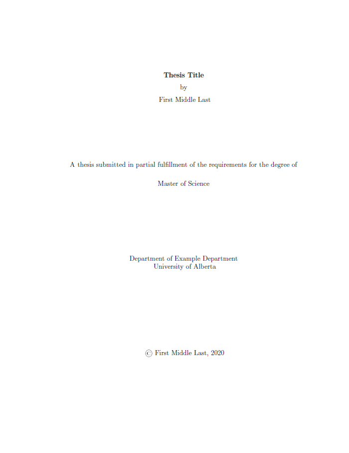

<h1 align="center">
  Welcome to the (Un)Official uAlberta Thesis LaTeX Template
</h1>

  
  
  

A LaTeX template for the University of Alberta. 
 
Compliant with the FGSR Standards for submitting a thesis, including conversion to PDF/A.
 
For more information on the template, please visit the dedicated website at: https://ualberta-thesis.daniel-aldrich.ca 

  <a href="#about">About</a> •
  <a href="#getting-started">Getting Started</a> •
  <a href="#download">Download</a> •
  <a href="#license">License</a>

      

## About
### The Long Story Why I Made This
As a graduate student from the University of Alberta, I understand the daunting task that is associated with writing a Thesis that conforms the the guidelines outlined in the FGSR Minimum Thesis Formatting Requirements. It can also be very frustrating to write long, equation and figure heavy, document in a word processor that is prone to crashes, file corruption, seemingly random changes to the formatting, and that do not output a document in the required PDF/A format for submission to FGSR.

Due to these problems, lots of students attempt to use an alternative to traditional word processors: LaTeX. 

LaTeX allows students/researchers to focus on either the writing of the document or the formatting. Because the writing is separated from the formatting, the writing of the documents can be performed in much more lightweight text editors, or TeX editors (that also allow for the compilation of the documents) that are able to constantly save the work and due to the plaintext nature, are not generally susceptible to file corruption.

LaTeX has the added benefit of providing a consistent and professional look and feel throughout the document. However, there does not appear to be a template for LaTeX that provides all the necessary formatting and packages to ease the formatting of documents written in LaTeX, while also adhering to the FGRS Thesis Formatting Requirements.

During my Master's program, I had worked with writing my thesis in LaTeX and though I was able to generate all the formatting I needed to submit my thesis, I knew it would be better if a proper thesis template existed. So after I finished submitting my thesis to FGSR, I started work on a template that would meet the requirements above and make the process of formatting your thesis more trivial. 

Included in my template are examples of how to layout specific element of a thesis, as well as a LaTeX class file that automatically generates the title and prefatory pages, allows for the inclusion of List of [Tables, Figures, Plates, and Symbols], Glossaries[^1], Indices[^1], provides a tool for generating tables in excel and exporting them to LaTeX, and generates a PDF/A output without the need of a paid program.

[^1]: When using the appropriate Packages.

### TL;DR
Word crashed on me one too many times.

## Getting Started

In general, you will need:
- A LaTeX Distribution (For Windows I recommend [MikTex](https://miktex.org/))
  - Comes with a simple LaTeX Editor (TexWorks)

Additionally, because lets be honest you are here because you want to spend less time on organizing, laying out, and formatting your thesis, I recommend the following:
- A Reference Manager - [JabRef](https://www.jabref.org/)
  - Allow DOI look up - no more copy pasting data to make a reference
  - PDF Markup and Sync - Allows you to attach the PDF to the reference and allows you to see all the comments and highlighted text from JabRef
  - Rating and Marking - Allows you rate, group, and mark references based on if they need to be read or how important they are
  - Microsoft Referencing - Supports Export to Word Reference Format
  - Dark Mode - Do you need any more reasons?
- A Better Editor - Now normally I would be recommended the not free editor [Bakoma-Tex](http://www.bakoma-tex.com/menu/about.php), however, the developer has passed away and is no longer available for purchase.... So I would recommend:
  - [TeXnicCenter](https://www.texniccenter.org/), 
  - [TeXStudio](https://www.texstudio.org/), or 
  - [TeXMaker](https://www.xm1math.net/texmaker/).
- Have a pesky paper previously written in word? or have a stickler professor who will not read a PDF file:
  - [pandoc](https://www.pandoc.org/) the incredible document conversion tool.
    - NOTE: to have proper citations in word you need to download a *.csl file - [CSL Repository](https://github.com/citation-style-language/styles)
    - ALSO NOTE: The conversions can be lossly and is meant to only assist with the conversions (Please double check the conversion results are satisfactory do not assume they are)
  
### Prerequisites
1. A LaTeX Distribution
2. A text/LaTeX Editor
3. The Files in this Repo

## Download

You can [download](https://github.com/draldric/uAlberta-Thesis-LaTeX-Template/releases/) the latest version of the template.

## Support this Project

If you find this template useful and would like to support its development, please consider sending a donation via e-transfer to [donate@daniel-aldrich.ca](donate@daniel-aldrich.ca). Please include "LaTeX Template Donation" in the message section of your e-transfer. Your contribution will help ensure that this template remains free and open-source for all to use.

## Authors

* **Daniel Aldrich** - [@draldric](https://github.com/draldric) - [Website](https://daniel-aldrich.ca/)

## License

This project is licensed under the MIT License - see the [LICENSE](LICENSE.md) file for details

---

> [Daniel R. Aldrich](https://www.linkedin.com/in/danielraldrich/) &nbsp;&middot;&nbsp;
> GitHub [@draldric](https://github.com/draldric)
